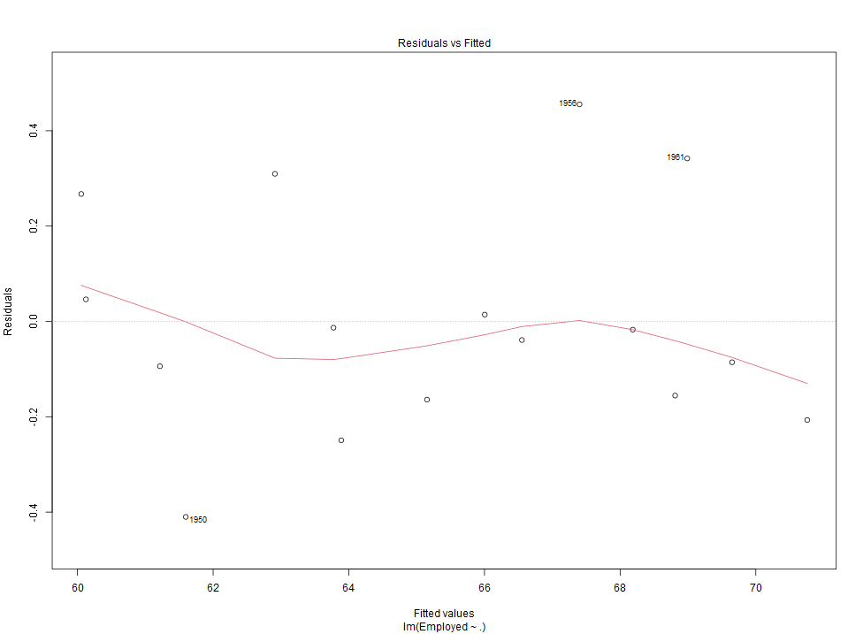
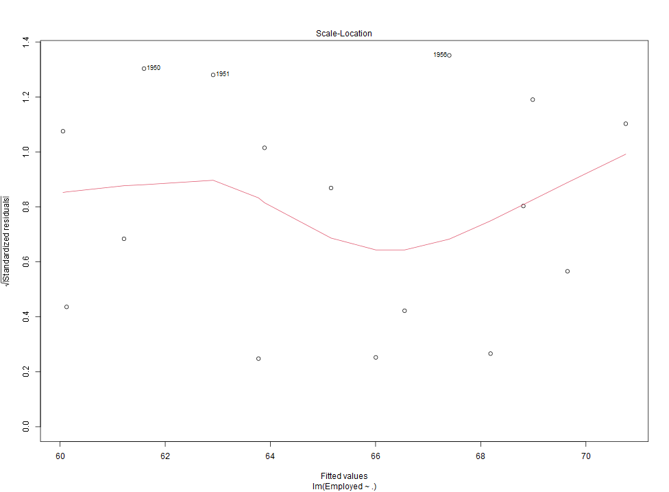
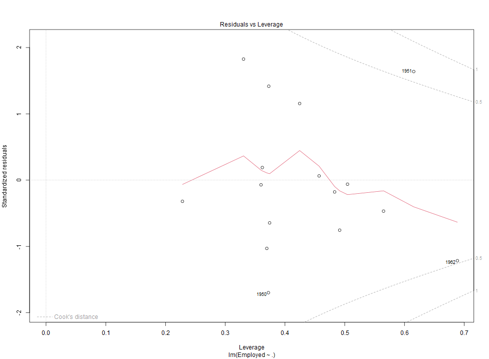
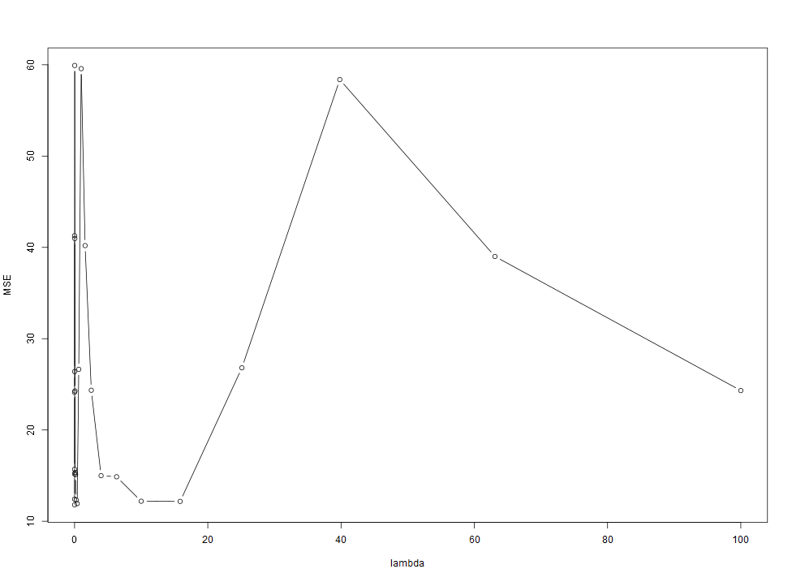
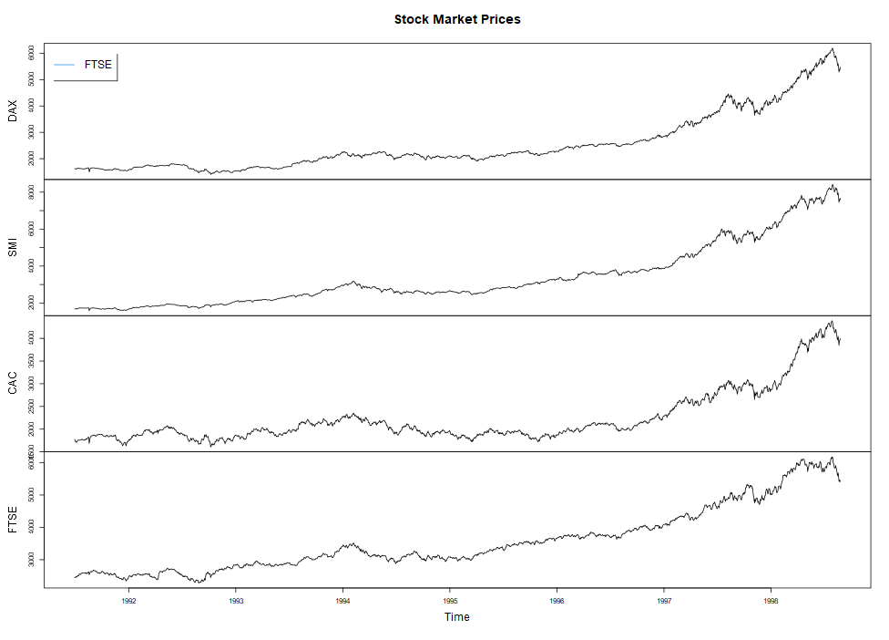
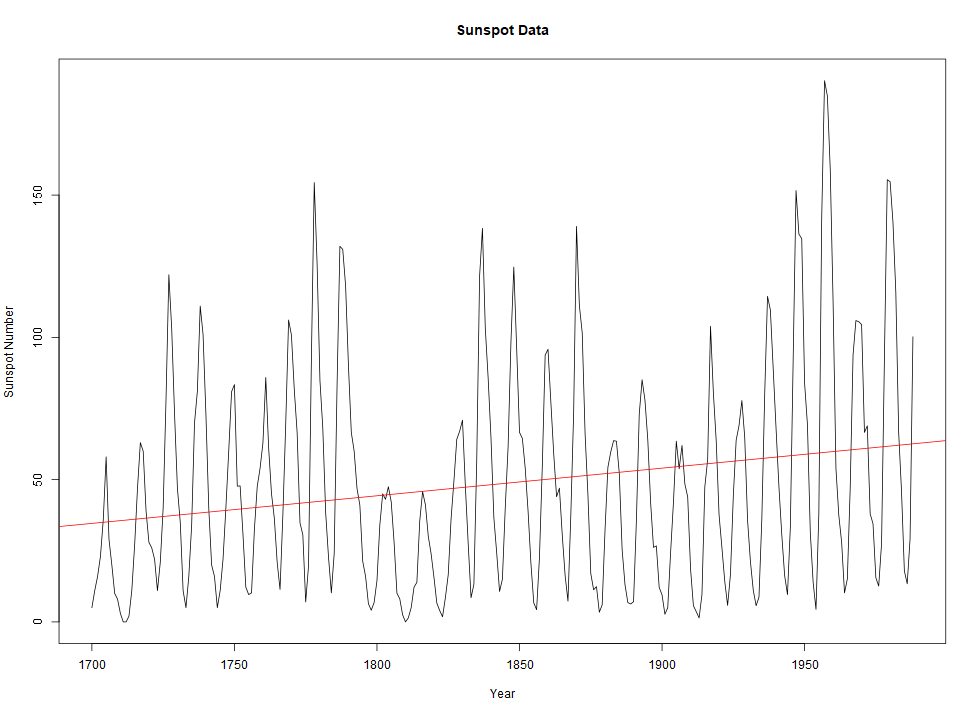

# regression_lab
regression_lab

## Work1
I created 4 models for the reglab1 dataset. They are:
* z ~ x
* z ~ x + y
* z ~ y
* z ~ x + y + x^2

They have summary output:

```
Call:
lm(formula = z ~ x, data = data)

Residuals:
    Min      1Q  Median      3Q     Max
-3.4444 -1.2875 -0.0162  1.2860  3.1660

Coefficients:
            Estimate Std. Error t value Pr(>|t|)
(Intercept)   2.4207     0.2242   10.80   <2e-16 ***
x             4.1693     0.3900   10.69   <2e-16 ***
---
Signif. codes:  0 '***' 0.001 '**' 0.01 '*' 0.05 '.' 0.1 ' ' 1

Residual standard error: 1.514 on 198 degrees of freedom
Multiple R-squared:  0.366,     Adjusted R-squared:  0.3628
F-statistic: 114.3 on 1 and 198 DF,  p-value: < 2.2e-16


Call:
lm(formula = z ~ x + y, data = data)

Residuals:
     Min       1Q   Median       3Q      Max
-0.97246 -0.16759  0.01308  0.20537  0.81127

Coefficients:
            Estimate Std. Error t value Pr(>|t|)
(Intercept) -0.02163    0.06384  -0.339    0.735
x            4.10248    0.08698  47.168   <2e-16 ***
y            4.94308    0.08035  61.517   <2e-16 ***
---
Signif. codes:  0 '***' 0.001 '**' 0.01 '*' 0.05 '.' 0.1 ' ' 1

Residual standard error: 0.3376 on 197 degrees of freedom
Multiple R-squared:  0.9686,    Adjusted R-squared:  0.9683
F-statistic:  3041 on 2 and 197 DF,  p-value: < 2.2e-16


Call:
lm(formula = z ~ y, data = data)

Residuals:
    Min      1Q  Median      3Q     Max
-2.7581 -0.7880 -0.0024  0.8417  2.6324

Coefficients:
            Estimate Std. Error t value Pr(>|t|)
(Intercept)   2.0268     0.1637   12.38   <2e-16 ***
y             4.9904     0.2810   17.76   <2e-16 ***
---
Signif. codes:  0 '***' 0.001 '**' 0.01 '*' 0.05 '.' 0.1 ' ' 1

Residual standard error: 1.181 on 198 degrees of freedom
Multiple R-squared:  0.6143,    Adjusted R-squared:  0.6124
F-statistic: 315.4 on 1 and 198 DF,  p-value: < 2.2e-16


Call:
lm(formula = z ~ x + y + I(x^2), data = data)

Residuals:
     Min       1Q   Median       3Q      Max
-0.88162 -0.17767 -0.01502  0.20300  0.87775

Coefficients:
            Estimate Std. Error t value Pr(>|t|)
(Intercept) -0.11687    0.08741  -1.337    0.183
x            4.63006    0.34332  13.486   <2e-16 ***
y            4.95602    0.08046  61.598   <2e-16 ***
I(x^2)      -0.53776    0.33862  -1.588    0.114    
---
Signif. codes:  0 '***' 0.001 '**' 0.01 '*' 0.05 '.' 0.1 ' ' 1

Residual standard error: 0.3363 on 196 degrees of freedom
Multiple R-squared:  0.969,     Adjusted R-squared:  0.9686
F-statistic:  2044 on 3 and 196 DF,  p-value: < 2.2e-16
```

The model z ~ x + y + I(x^2) is the best one because it has the highest value of Adjusted R-squared: 0.9686.

R is defined as followed:


So, when the R or R-squared approaches 1, it means that the SSE is small enough to fit the real distribution compared to SST.

## Work2
I used combn to get all the combinaros of x1,x2,x3,x3. Here are RSS values calculated by each combinator regression model:
```
[1] "Subset: x1 : 157.219775828453"
[1] "Subset: x2 : 268.245770839922"
[1] "Subset: x3 : 393.490468605497"
[1] "Subset: x4 : 394.590497460393"
[1] "Subset: x1, x2 : 0.537961710578259"
[1] "Subset: x1, x3 : 156.354065745632"
[1] "Subset: x1, x4 : 157.21926831528"
[1] "Subset: x2, x3 : 267.79545424301"
[1] "Subset: x2, x4 : 267.806136130255"
[1] "Subset: x3, x4 : 393.458728053751"
[1] "Subset: x1, x2, x3 : 0.332266214973758"
[1] "Subset: x1, x2, x4 : 0.361968248277299"
[1] "Subset: x1, x3, x4 : 156.348339703843"
[1] "Subset: x2, x3, x4 : 267.441547194395"
[1] "Subset: x1, x2, x3, x4 : 0.192863541483844"
```
The best one with minimal RSS value is Y ~ x1 + x2 + x3 + x4.

## Work3
Summary of model:
```
lm(formula = calAge ~ Depth + Weight, data = data)

Residuals:
    Min      1Q  Median      3Q     Max 
-1195.2  -517.1  -136.5   590.9  1275.8 

Coefficients:
             Estimate Std. Error t value Pr(>|t|)
(Intercept)  2401.142    475.262   5.052 0.000688 ***
Depth          20.735      1.061  19.535 1.12e-08 ***
Weight      -1894.163    709.761  -2.669 0.025676 *
---
Signif. codes:  0 '***' 0.001 '**' 0.01 '*' 0.05 '.' 0.1 ' ' 1

Residual standard error: 808 on 9 degrees of freedom
Multiple R-squared:  0.9773,    Adjusted R-squared:  0.9722
F-statistic: 193.3 on 2 and 9 DF,  p-value: 4.036e-08
```

The coefficients of the model indicate that, holding all other variables constant, a one-unit increase in "Depth" is associated with a 20.735 unit increase in "calAge," and a one-unit increase in "Weight" is associated with a 1894.163 unit decrease in "calAge."
```
calAge = 2401.142 + 20.735Depth - 1894.163Weight + error
```
The multiple R-squared of the model is 0.9773, indicating that the model explains 97.73% of the variance in "calAge." The adjusted R-squared is slightly lower at 0.9722, indicating that the adjusted R-squared accounts for the number of predictors in the model.

## Work4
Regression model for longley:






Ridge predction mse with different lambda value:



## Work5

R valure for each stock market:
```
1    DAX    0.733004360597276
2    SMI    0.794256076389544
3    CAC    0.530036807969691
4   FTSE    0.848090598583659
```
FTSE has the most dynamics.

## Work6
We get the output from the regerssion model predictions of profit of 4 quaters in 2016 individually:
```
[1] "Quater1 in 2016 pred: 36.759636363636"
[1] "Quater2 in 2016 pred: 36.4894545454542"
[1] "Quater3 in 2016 pred: 37.653939393939"
[1] "Quater4 in 2016 pred: 28.7939134199132"
[1] "In total: 139.696943722942"
```

And we get the average profit of each quater:
```
[1] "Quater1 average from 1960 to 2016: 17.3007272727273"
[1] "Quater2 average from 1960 to 2016: 17.3010909090909"
[1] "Quater3 average from 1960 to 2016: 17.932121212121"
[1] "Quater3 average from 1960 to 2016: 13.8164588744588"
```

The fourth quarter has lowest profit and the third quarter has the highest profit.

## Work7


## Work8
We get the output from the regerssion model predictions ofUKgas in 2016 individually:
```
[1] "Quater1 in 2016 pred: 2230.93591778592"
[1] "Quater2 in 2016 pred: 1076.88492063492"
[1] "Quater3 in 2016 pred: 505.936752136751"
[1] "Quater4 in 2016 pred: 1677.39161579161"
[1] "In total: 5491.149"
```

And we get the average profit of each quater:
```
[1] "Quater1 average from 1960 to 2016: 1104.75301180302"
[1] "Quater2 average from 1960 to 2016: 571.751587301585"
[1] "Quater3 average from 1960 to 2016: 285.023931623931"
[1] "Quater3 average from 1960 to 2016: 833.398453398452"
```

The third quarter has lowest profit and the first quarter has the highest profit.

## Work9
We get the output result from the regression model:
```
[1] "Predicted dist: 139.717255474453"
```
